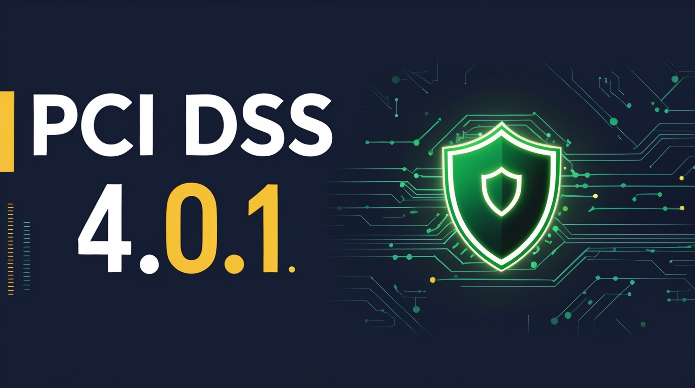

# 🔐 PCI DSS 4.0.1 Certification Automation

> **PowerShell + Python pipeline** to automate PCI DSS 4.0.1 evidence collection, control verification, and audit preparation — built and battle-tested in a production fintech payment processing environment.
> Designed to extend to SOC 2 and ISO 27001 via a built-in control crosswalk.

[](LICENSE)
[](https://github.com/suresh-1001/pci-dss-certification-automation)
[](https://github.com/suresh-1001/pci-dss-certification-automation)
[](https://github.com/suresh-1001/pci-dss-certification-automation)

---

## 📌 Overview

Manual PCI DSS audit prep is slow, error-prone, and expensive. This repo shows how I cut audit preparation time by **~60%** as Director of IT & Compliance at a fintech payment processing company by automating the full evidence lifecycle:

- **Collect** — PowerShell & Python scripts pull evidence from Windows, Entra ID, and Intune
- **Normalize** — Raw logs → JSON → CSV with control ID, system, and timestamp metadata
- **Report** — Markdown reports with hash-verified, zipped artifact bundles
- **Map** — PCI DSS → SOC 2 crosswalk for dual-framework coverage
- **Summarize** — AI-assisted (Claude / ChatGPT) narrative generation for auditor-facing SOPs

> ⚠️ **All examples use synthetic/redacted data.** Replace placeholders with your environment variables and scrub sensitive info before use.


---

## ⚙️ Key Features

| Feature | Description |
|---|---|
| 🗂️ Evidence Collectors | Automated scripts for controls 8.x, 10.x, 12.x |
| 🔄 Normalization Pipeline | raw → JSON → CSV → Markdown report |
| 📦 Audit-Ready Packets | Zipped bundles with SHA hash manifest |
| 🔗 Control Crosswalk | PCI DSS ↔ SOC 2 Common Criteria mapping |
| 🤖 AI Summarization | Claude + ChatGPT prompts for SOP generation |
| 🔒 Redaction Support | Pattern-based scrubbing of PII, hostnames, IPs |

---

## 🏗️ Architecture

```
pci-dss-certification-automation/
├─ scripts/
│  ├─ collect-evidence.ps1      # PowerShell evidence collector
│  ├─ export-logs.py            # Log parser & normalizer
│  └─ generate-report.py        # Markdown/PDF report builder
├─ crosswalk/
│  └─ pci_to_soc2.csv           # PCI DSS → SOC 2 mapping
├─ docs/
│  ├─ SOP_*/                    # Runbooks & narrative templates
│  └─ prompts/                  # AI summarization prompts
├─ examples/                    # Sample evidence + rendered reports
├─ Portfolio-Playbook/          # Step-by-step screenshots
└─ case-studies/001-sample/     # Redacted real-world example
```

---

## 🚀 Quick Start

```bash
# 1) Create a Python virtual environment
python -m venv .venv && source .venv/bin/activate  # Windows: .venv\Scripts\activate

# 2) Install requirements
pip install -r requirements.txt

# 3) Run a targeted PCI control evidence grab
pwsh ./scripts/collect-evidence.ps1 -Control "8.1.1" -Export json -OutDir ./examples/8.1.1

# 4) Normalize logs and build a mini report
python ./scripts/export-logs.py --input ./examples/8.1.1 --output ./examples/8.1.1/normalized.json
python ./scripts/generate-report.py --control 8.1.1 --input ./examples/8.1.1 --out ./examples/8.1.1/REPORT_8.1.1.md
```

### Example — Multi-system evidence pull

```powershell
.\scripts\collect-evidence.ps1 -Control "10.2.1" -Systems "Windows,Ubuntu,Firewalls" -Export json -OutDir .\examples\10.2.1
```

### Example — SOC 2 aligned report

```bash
python ./scripts/generate-report.py --framework soc2 --control 10.2.1 --input ./examples/10.2.1 --out ./examples/10.2.1/REPORT_SOC2.md
```

---

## 📈 Results (Production Fintech Environment)

| Metric | Before | After |
|---|---|---|
| Audit prep time | ~5 weeks manual | ~2 weeks automated |
| Evidence re-requests | Frequent | Near zero |
| Artifact integrity | No verification | SHA hash manifests |
| Framework coverage | PCI only | PCI + SOC 2 crosswalk |

> **~60% reduction in audit preparation time** with repeatable, documented, hash-verified runs.

---

## 🔗 PCI → SOC 2 Crosswalk

`crosswalk/pci_to_soc2.csv` maps sampled PCI DSS requirements to SOC 2 Common Criteria (CC).

Use the `--framework soc2` flag with `generate-report.py` to emit SOC 2-aligned evidence summaries from the same evidence collection run — no duplicate work.

---

## 🔐 Security & Redaction Notes

- **Never commit** raw log data, API keys, or customer PII
- Use `redact_patterns.txt` with `export-logs.py` to scrub hostnames, emails, and public IPs
- Store real evidence in a **private repo** or secure bucket with a defined retention policy
- All examples in `/examples` use **synthetic data only**

---

## 🛣️ Roadmap

- [ ] Linux CIS module for controls 8.x & 10.x
- [ ] Juniper / Cisco config scrapers
- [ ] HTML + PDF report outputs
- [ ] ISO 27001 Annex A control mapping
- [ ] GitHub Actions workflow for scheduled evidence runs

---

## 🧠 Skills & Tools

`PowerShell` `Python` `PCI DSS 4.0.1` `SOC 2` `ISO 27001` `Evidence Automation` `Entra ID` `Intune` `Claude` `ChatGPT`

---

## 📝 License

MIT — see [`LICENSE`](LICENSE). Free for commercial and educational use.

---

## 📬 Contact

- **Email:** suresh@echand.com
- **LinkedIn:** [linkedin.com/in/sureshchand01](https://linkedin.com/in/sureshchand01)
- **GitHub:** [github.com/suresh-1001](https://github.com/suresh-1001)
